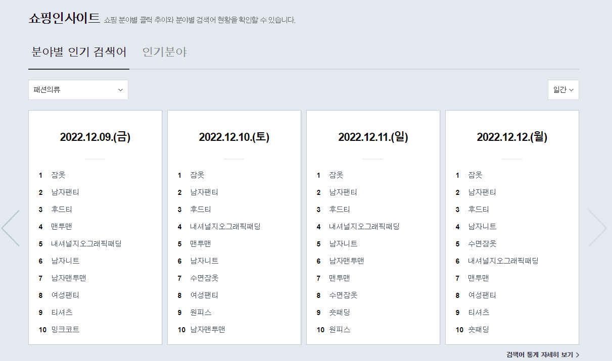
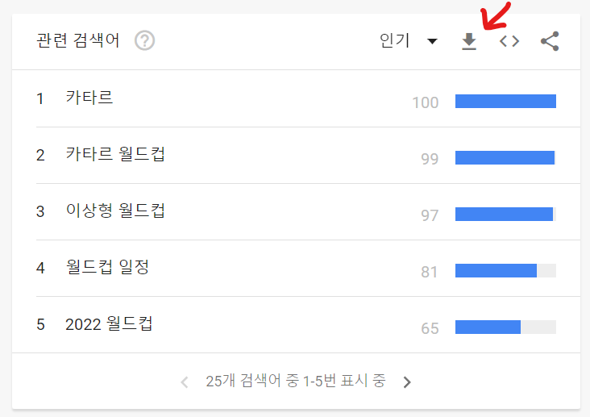

## 비정형 데이터 구하기

### 사용방법

	1. main.py 파일을 다운받는다.
	2. 데이터 출처에 쓰여저있는 3가지 데이터중 원하는 데이터를 다운 받는다.
	3. main.py랑 CSV 파일을 같은 폴더에 넣는다.
	4. main.py을 실행시킨다.
	5. 파일의 경로(상대 경로)과 파일의 출처를 입력한다.

### 데이터 출처

1. 네이버 데이터랩 https://datalab.naver.com/
2. 행정안전부 주민등록 인구통계 https://jumin.mois.go.kr/index.jsp
3. 구글 트렌드 인기 검색어 https://trends.google.co.kr/trends/?geo=EU

## 데이터 다운받는법

### 1.네이버 데이터랩

1. 위 사이트로 들어간다.

   

2. 그럼 위 화면이 뜹니다. 

3. 쇼핑인사이트에 들어가서 분야별 인기 검색어, 인기분야중 하나를 선택한다.

4. 분야별 인기 검색어 밑에있는 패션의류를 클릭하여 원하는 조회분야를 선택한다.

5. 그리고 원하는 날짜를 선택한다.

6. 그 날짜에 있는 원하는 검색어를 클릭한다.

   

7. 그럼 위 화면이 뜹니다.

8. 빨간화살표가 가리킨 버튼을 클릭한다.

번외. 위 사진에 검색어 옆에 '비교할 검색어 추가' 칸에다가 비교하고싶은 검색어를 입력하면 비교하고싶은 검색어가 추가됩니다.

### 2.행정안전부

1. 위 사이트로 들어간다.

   

2. 그럼 위 화면이 뜹니다. 

3. 위 사진에 보이는 행정구역,등록구분,조회기간 등등을 설정한다.

4. 파란색으로 되어있는 '검색' 버튼을 클릭한다.

5. 오른쪽 하단에 있는 'csv 파일 다운로드' 버튼을 클릭한다.

### 구글 트렌드

1. 위 사이트로 들어간다.

   

2. 그럼 위 화면이 뜹니다. 

3. 찾고 싶은 검색어 또는 주제를 입력합니다.

4. 스크롤을 맨 밑으로 내립니다.

   

5. 그럼 위 화면이 뜹니다.

6. 빨간 화살표가 가리키는 버튼을 클릭합니다.

## 데이터의 특징

### 네이버 데이터랩

네이버 데이터랩의 데이터에는 1번부터 6번까지는 세로로 범례를 나타냈는데 7번부터는 가로로 범례를 나타내고 있다는 특징이 있다.

### 행정안전부

행정 안전부 데이터는 숫자 구분이 쉼표로 되어있어 파이썬으로 바로 처리하기에 문제가 있다는 특징이 있다.

### 구글 트렌드

구글 트렌드 데이터의 위 부분을 보면 원하는 데이터위에 우리에게 필요하지 않은 문자들이 있는 특징이 있습니다.

## 결과 예시

#### 네이버 데이터랩

#### 행정안전부

#### 구글트렌드

